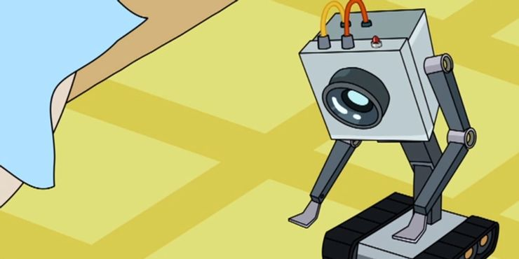

# What is Conway’s “Game of Life”

## A Brief Summary of the Game

You have a grid with cells. They can either spawn dead or alive.

The status of the neighbouring cells determines whether the cell dies, reproduces, or stays alive for the next generation.

###### checking cell “E”. It has five dead neighbours (A,B,C,H,I) and three living ones (D,F,G)

If a cell is **alive** it will:

- Die if there are less than two living neighbours.
- Continue living if there are exactly two or three living neighbours.
- Die if there are more than three living neighbours.

If a cell is **dead** it will:

- Resurrect (become alive) if there are exactly three living neighbours.

In the example above, E would resurrect if it were dead — because it has three living neighbours — and stay alive if it were alive — because it has exactly two or three living neighbours

# How?

This program is heavily inspired from this Medium [blog](https://medium.com/better-programming/how-to-write-conwells-game-of-life-in-python-c6eca19c4676)

# Why?

I Needed some content for Reels, and a Weekend so why not. and is a simple project with little time to invest and great visual results.

### **what's its purpose ?**

### 	to make a reel 

### **...Welcome To The Club, Pal.**

